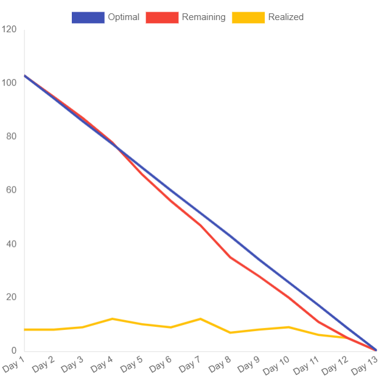

 

 

    <a href="#objetivos">Objetivos da sprint</a> &nbsp |&nbsp &nbsp
    <a href="#entregas">Entregas</a> &nbsp |&nbsp &nbsp
    <a href="#metricas">Métricas do time</a> &nbsp |&nbsp &nbsp

O projeto tem como objetivo desenvolver um aplicativo mobile que facilite o monitoramento da dieta do usuário, permitindo o registro do consumo e do gasto calórico. Na sprint 03, os esforços foram direcionados à implementação de novas telas no aplicativo, à expansão das informações no banco de dados e à melhoria do design das interfaces.

## :dart: Objetivos da Sprint
Os requisitos (funcionais e não funcionais) abrangidos por essa sprint são:
- RF 06: Definir metas
- RF 08: Ver macros das refeições
- RNF 09: Documentação e gerenciamento no GitHub
- RNF 10: Processo Scrum
- RNF 11: Back-end: TypeScript e Node.js
- RNF 12: Front-end: React Native, TypeScript
- RNF 13: Armazenamento: SGBD MongoDB

→ [Voltar ao topo](#topo)

        
## :heavy_check_mark: Entregas

### Cadastro de usuário na plataforma

Nessa sprint conseguimos realizar o cadastro do usuário no banco de dados utilizando uma extensão do Visual Studio Code, chamada Thunder Client, que permite a realização de testes que conferem se os dados estão sendo salvos no banco de dados. Com esses testes foi possível constar que estava tudo em ordem, faltando apenas integrar com as telas de cadastro.

→ [Voltar ao topo](#topo)

### Cadastro de novos alimentos

Também entregamos a possibilidade do usuário cadastrar alimentos em seu banco de dados, tanto pela API Open Food Facts, quanto pelo banco de dados chamado TACO. Esse também foi testado pela extensão Thunder Client e está funcionando corretamente.

→ [Voltar ao topo](#topo)

### Registrar refeições e adicionar itens nelas

Nessa entrega realizamos a parte visual da tela para registrar as refeições, com botões, locais para inserir os dados e a navegação dessa página com as outras, assim como a integração com o banco de dados.

→ [Voltar ao topo](#topo)

### Registrar atividades físicas

Assim como no tópico anterior, nessa entrega realizamos a parte visual da tela de registro de atividades físicas e criamos a tabela no banco de dados que será registrado esses dados, porém ainda não concluimos a integração da parte visual com o banco de dados.

Sendo assim, finalizamos os requisitos propostos para esta sprint.

→ [Voltar ao topo](#topo)

 
     
## :chart_with_upwards_trend: Métricas do time
Em prol de um melhor aproveitamento do tempo disponível durante a segunda sprint o time se dividiu em atividades como: Cadastro de usuário na plataforma, cadastro de novos alimentos, documentação do GitHub, registro refeições e adicionar itens nelas e registro de atividades físicas, assim como estruturação da equipe para gestão das horas com o gráfico burndown.
    

    

→ [Voltar ao topo](#topo)
