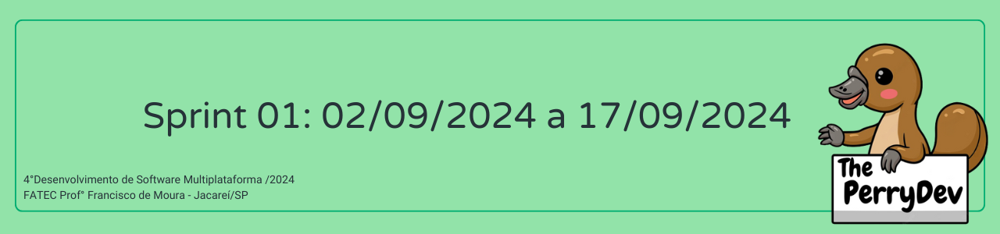
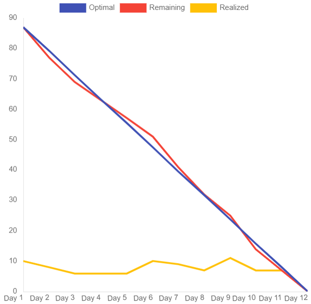

 

 

    <a href="#objetivos">Objetivos da sprint</a> &nbsp |&nbsp &nbsp
    <a href="#entregas">Entregas</a> &nbsp |&nbsp &nbsp
    <a href="#metricas">Métricas do time</a> &nbsp |&nbsp &nbsp

O projeto constitui na construção de uma aplicação mobile que auxilie o monitoramento da dieta de um usuário através da inserção de consumo e gastos calóricos. Com base nessa estruturação a sprint 01 consistiu em horas voltadas para o levantamento de dados, o desenvolvimento do wireframe, o desenvolvimento de design e identidade visual, a modelagem do banco de dados e o desenvolvimento das telas de cadastro e login.

[LINK DE APRESENTAÇÃO DA SPRINT 01](https://drive.google.com/file/d/1X_RZB2BagwwqgAaqVM5RqBzSTGLluFpU/view?usp=drive_link)

## :dart: Objetivos da Sprint
Os requisitos (funcionais e não funcionais) abrangidos por essa sprint são:
- RF 01: Cadastro do usuário na plataforma
- RF 02: Gerenciar as calorias ingeridas informando o alimento consumido
- RNF 09: Documentação e gerenciamento no GitHub
- RNF 10: Processo Scrum
- RNF 11: Back-end: TypeScript e Node.js
- RNF 12: Front-end: React Native, TypeScript

→ [Voltar ao topo](#topo)

        
## :heavy_check_mark: Entregas

### Levantamento de requisitos

O levantamento de requisitos desse projeto foi realizado através de pesquisas de mercado, onde todos do grupo se juntaram para dar ideias de como contruir nosso produto, a partir disso criou-se o User Stories e classificando-os em requisitos funcionais e não funcionais (tabelas todas se encontram no tópico [**Backlogs**](#backlogs) do readme principal deste repositório). Além da organização dos requisitos em cada sprint, gerando o Sprint Backlog.

→ [Voltar ao topo](#topo)

### Modelagem do Banco de Dados

A partir do levantamento de requisitos, foi criado uma modelagem do banco de dados para que facilite no momento da implementação do nosso projeto.

→ [Voltar ao topo](#topo)

### Elaboração do wireframe(identidade visual e design do sistema)

Como proposta para solucionar o projeto requisitado de uma aplicação mobile para o monitoramento dos ganhos e gastos calóricos, foi realizado o seguinte wireframe do nosso produto:

→ [Voltar ao topo](#topo)

### Criação das Tabelas e Base do Front-End
Com toda a pesquisa inicial desenvolvida, somado ao modelo do banco de dados fornecido pelo cliente e ao wireframe proposto, foram desenvolvidas as tabelas de USERS, com a intenção de gestores registrarem novos usuários no sistema, juntamente com a Base do Front-End, de forma que o cliente possa visualizar, mesmo que de forma bastante simplificada, como o sistema da plataforma da empresa irá funcionar.

Sendo assim, finalizamos os requisitos propostos para esta sprint.

→ [Voltar ao topo](#topo)

 
     
## :chart_with_upwards_trend: Métricas do time
Em prol de um melhor aproveitamento do tempo disponível durante a primeira sprint o time se dividiu em atividades como: planejamento, brieffing, estruturação do GitHub, criação do product backlog, sprint backlog, pesquisa e elaboração do design e da Identidade Visual, criação do wireframe e layout do site, assim como estruturação da equipe para gestão das horas com o gráfico burndown.
    

    

→ [Voltar ao topo](#topo)