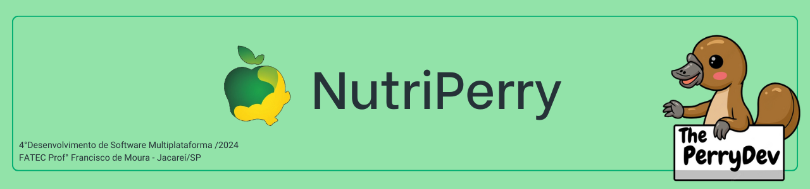
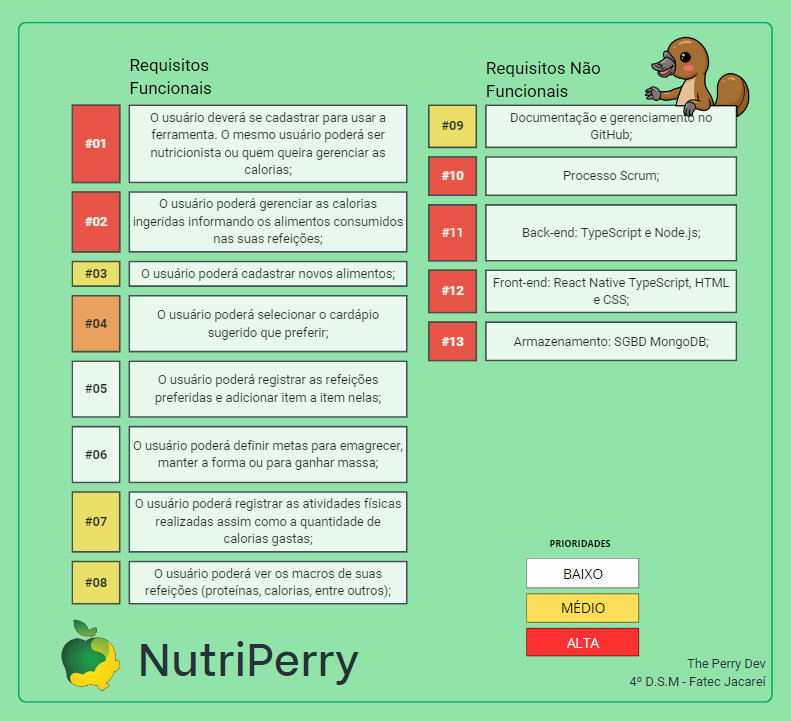
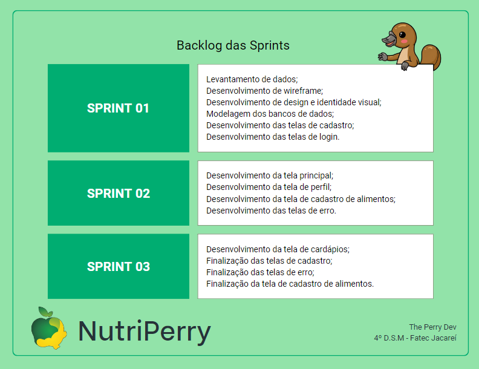
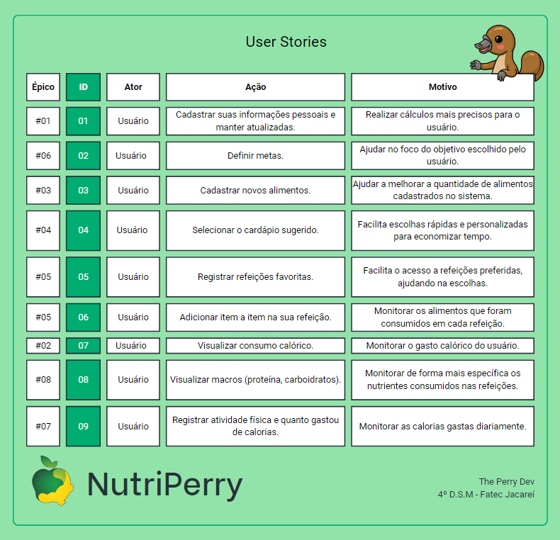

 

 

    <a href="#sobre">Sobre</a>  |  
    <a href="#backlogs">Backlog</a>  |  
    <a href="#user-stories">User Stories</a>  |    
    <a href="#tecnologias">Tecnologias</a>  |  
    <a href="#equipe">Equipe</a>  |  
    <a href="#final">Apresentação Final</a>

## :bookmark_tabs: Sobre o projeto

A partir da apresentação do desafio dado pela empresa FATEC, a solução apresentada pela empresa The Perry Dev consiste na criação de um aplicativo móvel onde o usuário poderá monitorar as calorias ingeridas e gastas durante o dia.

> _Projeto baseado na metodologia ágil, utilizando o Framework SCRUM, procurando desenvolver a Proatividade, Autonomia, Colaboração e Entrega de Resultados dos envolvidos_

:pushpin: Status do Projeto: [**Em Andamento**](https://github.com/ThePerryDev/NutriPerry/tree/sp1/develop) :on:

### Entregas de Sprints

Cada entrega será realizada a partir da criação de uma **tag** no repositório (NutriPerry), assim como a criação de branchs específicas para cada Sprint a fim de controlar cada etapa do projeto. Observe a relação a seguir:
| Sprint | Previsão | Status | Histórico | Link da Apresentação
|:------:|:----------:|:-------------|:-------------------------------------------------:|:-------------------------------------------------:|
| 01 | De 02/09/24 a 17/09/24 | 🟢 Finalizado | [Ver relatório](https://github.com/ThePerryDev/NutriPerry/tree/sprint-01)| [SPRINT 01](https://drive.google.com/file/d/1X_RZB2BagwwqgAaqVM5RqBzSTGLluFpU/view?usp=drive_link)|
| 02 | De 18/09/24 a 08/10/24 | 🟢 Finalizado | [Ver relatório](https://github.com/ThePerryDev/NutriPerry/tree/sprint-02)| [SPRINT 02](https://youtu.be/mZhYl-Wf9Bk)|
| 03 | De 09/10/24 a 08/11/24 | 🟢 Finalizado | [Ver relatório](https://github.com/ThePerryDev/NutriPerry/tree/sprint-03) | Não iniciado |

## :dart: Backlog 

 

 

→ [Voltar ao topo](#topo)

## :mag: User Stories

 

→ [Voltar ao topo](#topo)

## :pager: Tecnologias

Para a construção do nosso projeto, utilizamos uma variedade de linguagens, ferramentas, tecnologias e bibliotecas. Cada uma dessas escolhas foi cuidadosamente considerada para garantir a melhor implementação e atender aos requisitos do projeto. Abaixo, apresentamos as utilizadas na construção do projeto.

 

→ [Voltar ao topo](#topo)

## :busts_in_silhouette: Equipe

|    Função     | Nome                                  |                                                                                                                                                      LinkedIn & GitHub                                                                                                                                                      |
| :-----------: | :------------------------------------ | :-------------------------------------------------------------------------------------------------------------------------------------------------------------------------------------------------------------------------------------------------------------------------------------------------------------------------: |
|   Scrum Master   | Willian Garcia               |   |
|   Product Owner   | Bianca Lucas                |      |
|   Dev Team   | Daniel Dornelas                     |            |
|   Dev Team   | Franciele Chesere           |                     |
|   Dev Team   | Heclair Sousa           |                     |
|   Dev Team   | Luis Eduardo       |                 |

→ [Voltar ao topo](#topo)
