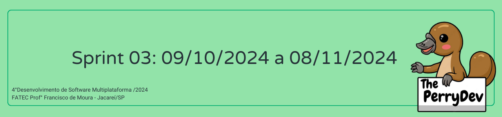
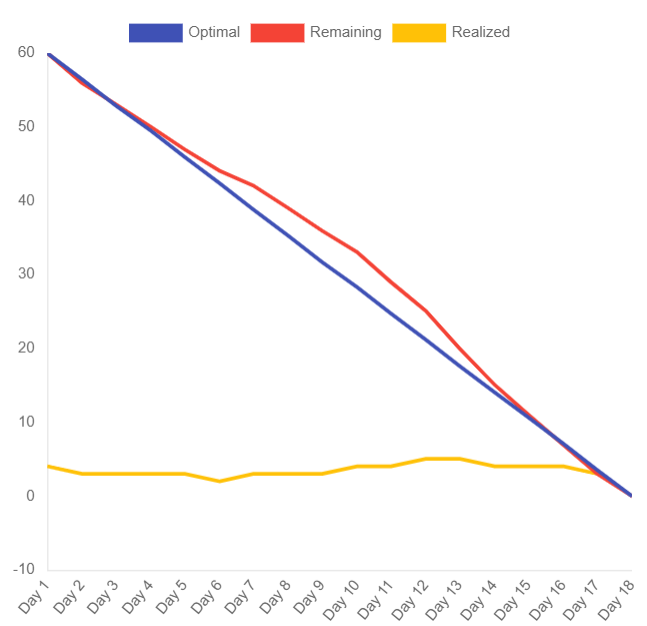

 

 

    <a href="#objetivos">Objetivos da sprint</a> &nbsp |&nbsp &nbsp
    <a href="#entregas">Entregas</a> &nbsp |&nbsp &nbsp
    <a href="#metricas">Métricas do time</a> &nbsp |&nbsp &nbsp

O projeto tem como objetivo desenvolver um aplicativo mobile que facilite o monitoramento da dieta do usuário, permitindo o registro do consumo e do gasto calórico. Na sprint 03, os esforços foram direcionados à implementação de novas telas no aplicativo, à expansão das informações no banco de dados e à melhoria do design das interfaces.

## :dart: Objetivos da Sprint
Os requisitos (funcionais e não funcionais) abrangidos por essa sprint são:
- RF 01: Cadastro do usuário na plataforma
- RF 06: Definir metas
- RF 08: Ver macros das refeições
- RNF 09: Documentação e gerenciamento no GitHub
- RNF 10: Processo Scrum
- RNF 11: Back-end: TypeScript e Node.js
- RNF 12: Front-end: React Native, TypeScript
- RNF 13: Armazenamento: SGBD MongoDB

→ [Voltar ao topo](#topo)

        
## :heavy_check_mark: Entregas

### Cadastro de usuário na plataforma

Durante esta sprint, implementamos o cadastro de usuários no banco de dados e concluímos a integração entre o backend e o frontend. Agora, os usuários podem criar uma conta diretamente pelo aplicativo e realizar o login de forma funcional.

→ [Voltar ao topo](#topo)

### Definir metas

Nesta sprint, implementamos a funcionalidade que permite aos usuários definir metas personalizadas para a ingestão de nutrientes e o consumo de água.

→ [Voltar ao topo](#topo)

### Ver macros das refeições

Nesta sprint, desenvolvemos a tela principal (home), onde são exibidos os macronutrientes das refeições do usuário. Com essa funcionalidade, o usuário pode monitorar o consumo de calorias, avaliar o progresso de sua dieta e decidir se deseja realizar ajustes ou manter o plano atual.

Sendo assim, finalizamos os requisitos propostos para esta sprint.

→ [Voltar ao topo](#topo)

 
     
## :chart_with_upwards_trend: Métricas do time
Em prol de um melhor aproveitamento do tempo disponível durante a terceira sprint o time se dividiu em atividades como: Cadastro de usuário na plataforma, definir metas, ver macros das refeições documentação do GitHub, assim como estruturação da equipe para gestão das horas com o gráfico burndown.
    

    

→ [Voltar ao topo](#topo)
